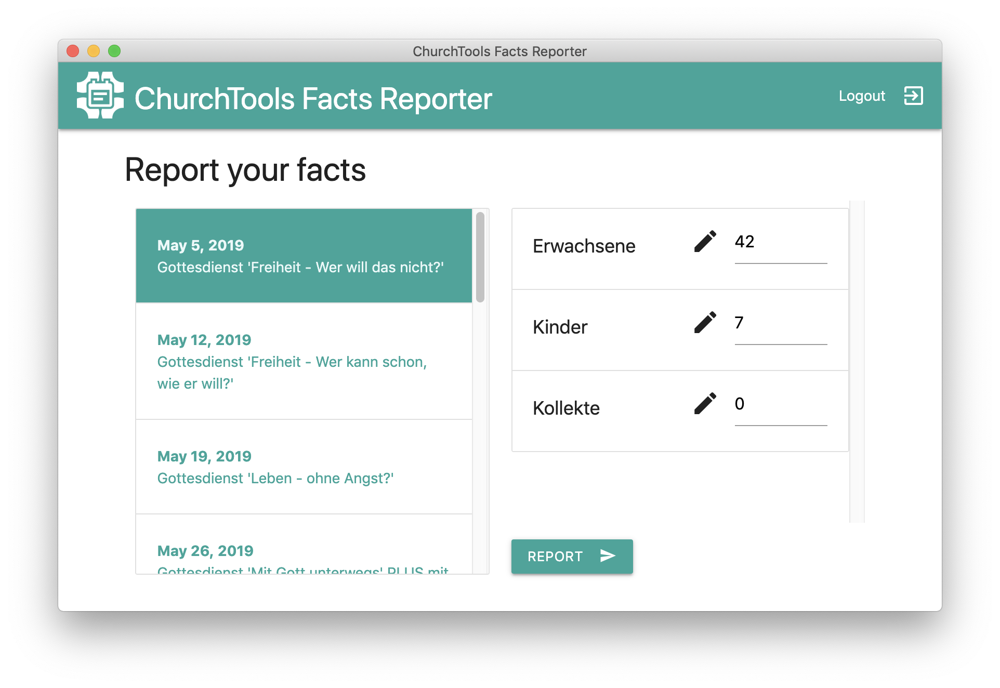

*Note: This project is no longer maintained.*

# ChurchTools Facts Reporter

This desktop application provides an easy way to report facts about events in [ChurchTools](http://church.tools). The software is based on [Electron](http://electronjs.org) and can be used cross-platform on Windows, MacOS and Linux.



If you like my project and want to keep me motivated:

<a href='https://ko-fi.com/U7U6COXD' target='_blank'></a>

## Current features

* Display all facts columns from ChurchTools 
* Securely store ChurchTools credentials in system's keychain
* Auto-login on application start
* Auto-logout on application exit
* Auto-selection of latest event within the last six days
* Show warning prompt before overwriting existing values


## Use it

If you want to use the Facts Reporter, check out the packaged releases for Windows, MacOS and Linux [here](https://github.com/philipptrenz/ChurchTools-Facts-Reporter/releases).

## Improve it

Any suggestion and improvement is highly welcome! If you encounter a bug, please write an [issue](https://github.com/philipptrenz/ChurchTools-Facts-Reporter/issues). If you have improved the software, please share your improvements, in the sense of the open source philosophy, with a [pull request](https://help.github.com/en/articles/about-pull-requests). 

### Install

To get started with coding, you need [node](http://nodejs.org), [yarn](https://yarnpkg.com/lang/en/) and some skills in web technologies. 

```
# Install dependencies
yarn install

# Run the app
yarn start
```

*Note:* If you are on Linux install the `libsecret` library first ([see here](https://www.npmjs.com/package/keytar#on-linux)).


### Package application

Generate executables for Windows, MacOS and Linux is as easy as this:

```
# Package the application
yarn dist
```

Afterwards you find the binaries within the `dist/` folder.
