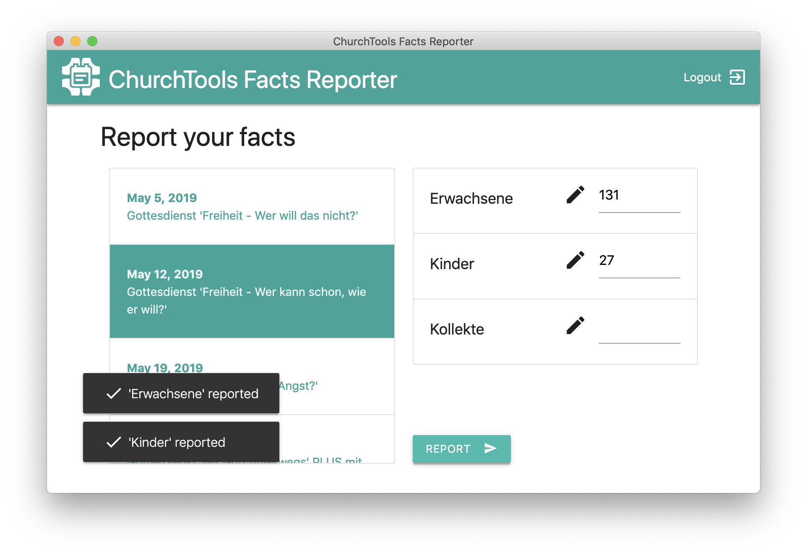

# ChurchTools Facts Reporter

This desktop application provides an easy way to report facts about events in [ChurchTools](http://church.tools). The software is based on [Electron](http://electronjs.org) and can be used cross-platform on Windows, MacOS and Linux.



If you like my project and want to keep me motivated:

<a href='https://ko-fi.com/U7U6COXD' target='_blank'></a>

## Features

* Securely store ChurchTools credentials in system's keychain
* Auto-login on application start
* Auto-logout on application exit
* Auto-selection of latest event within the last six days

## Install

```
# Install dependencies
yarn install

# Run the app
yarn start
```

*Note:* If you are on Linux install the `libsecret` library first ([see here](https://www.npmjs.com/package/keytar#on-linux)).


### Package application

```
# Package the application
yarn dist
```
	